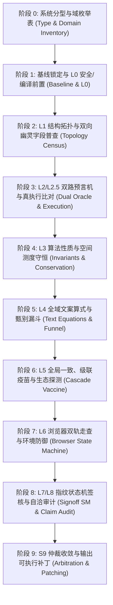

# 系统化测试与全态对偶穷举验证 Skill (Systematic Verifier)

本 Skill 将成熟 SDET 软件工程方法、形式化验证理论与多轮实测淬火经验封装为完全自治的工程流水线。
当用户需要对项目开展**系统化测试、全站代码/数据审查、回归防退化治理、或 PR 增量差分质检**时，触发本 Skill。

## 核心公理（The Six Axioms）

在执行任何具体断言之前，必须时刻恪守六大治军公理：
1. **Oracle 三级隔离**：A 级（机器自算力）与 B 级（语义审阅逐题落盘）并行；严禁将事后 C 级（回归守卫）冒充发现级。
2. **接线必须通电**：杜绝三大假闭合（未读变量、首行 Null 崩溃、分支同模）；输入变 $\implies$ 输出必须产生差分。
3. **逆向与反例穿透**：答错路径必测（计分条答错绝不 +1）；越界输入优雅拦截；教学反例通过上下文守卫分流。
4. **领域规范化与甄别漏斗**：前置转译商余/带分数/中文位值；公式失配逐级收窄，残差必须 100% 人工复核。
5. **数字不经人手**：覆盖声明必须由代码自己打印；数据源 $\leftrightarrow$ 产物 bundle $\leftrightarrow$ 页面 stats 三向互锁。
6. **三层定罪与基线干净**：排查顺序：①测试脚本错 $\to$ ②测试环境错 $\to$ ③被测物真 Bug；每个测试点前读回干净基线。

---

## 阶段化执行流水线 (Phase-by-Phase Execution SOP)



---

### 阶段 0：系统分型与域枚举表建立（先行证明有限）
1. **识别被测物分型**：
   - Type I（纯数据驱动内容/题库站）：核心挂载 L1, L2, L4, L5, L7。
   - Type II（代码教学与聚合管道站）：强制挂载 L0(安全), L2.5(真执行), L5(级联疫苗)。
   - Type III（空间 IR 编译与 WebGL 系统）：强制挂载 L0(算子前置), L3(测度守恒), L6(双轨走查)。
   - Type IV（同源多 Agent 流水线）：强制挂载 0.1(共享域切分), S9(交叉仲裁), L8(自洽)。
2. **生成域枚举表并声明口径**：
   - 运行 `node scripts/domain_inventory.js`，统计路由、数据记录、待验答案、文案串、微算式、交互控件、资产引用等规模。
   - 注入基数互锁断言（如 `题目总数 === 单元数 * 5`），数量对不上直接终止。

---

### 阶段 1：基线锁定与 L0 安全/编译前置
1. **工作区与依赖版本对齐**：
   - 全新克隆干净 Commit，禁止脏工作区测试；计算线上与仓库全量文件 MD5 哈希。
   - 钉死外部 CDN（KaTeX/Three.js）同版本，防范因渲染库差异导致虚假失败。
2. **不可信内容安全暴露面普查**（针对 Type II）：
   - 扫描 markdown 围栏外裸 `<script>`、`on*` 属性、`javascript:` 伪协议。
   - 断言清洗发生在插入 DOM（`innerHTML`）**之前**，杜绝 TOCTOU 窗口。
3. **IR 算子几何非奇异性数学断言**（针对 Type III）：
   - 折痕端点有效距离 $\text{dist}(a, b) > 10^{-4}$；
   - 参考移动点到折线垂直距离 $\text{dist}(m, \overline{ab}) > 10^{-4}$，杜绝因法向点积为 0 导致方向随机。

---

### 阶段 2：L1 结构拓扑与双向幽灵字段普查
1. **双向幽灵字段普查**：
   - 正向：代码引用的字段在数据中必须存在（杜绝单个 `q.img` 缺失导致万题白屏）。
   - 反向：数据字段必须在代码中有消费，或在文档中声明为预留，孤儿字段单独审计。
2. **双向拓扑强闭合**：
   - 全站站内相对链接 100% 存在；
   - 同页锚点 `href="#id"` $\leftrightarrow$ 真实元素 `id` 100% 闭合（消除全站死锚）；
   - 别名字典（`ALIASES`）目标存在；面包屑文本与目标页面 `title` 语义强相关。

---

### 阶段 3：L2/L2.5 双路预言机与真执行比对
1. **A 级代数独立演算与格式规范**：
   - 从原始输入推导期望值，零共享被测实现；选择题答案正则 `^[A-H]{1,4}$` 断言；
   - 选项两两互斥断言；解析“故选X”与答案首字母 100% 互锁。
2. **B 级语义审阅实时逐题落盘**：
   - 针对概念问答、教学方向，独立 Agent 阅读并在当下向 `l2_audit_trail.jsonl` 逐行写入审计日志，禁止留在会话记忆中。
3. **L2.5 代码教学站真执行与声称比对**（Type II 必跑）：
   - 沙箱子进程执行 Python/JS 代码；
   - 提取行尾注释（`# 19.05`）与结果块声称输出，逐行与真实 stdout/stderr 对验；
   - CJK 中文讲解注释启发式正则分流留痕。

---

### 阶段 4：L3 算法性质与空间测度守恒
1. **先实测尺寸再写量纲不变量**：
   - 严禁脑补物理含义，先实测产物实际像素尺寸，再写数学不变量。
2. **空间四大几何不变量**（Type III 必跑）：
   - *三维测度守恒*：使用独立 Newell 向量微积分求和空间多边形表面积，刚性折叠下断言 $|\Delta| \le 0.5\%$。
   - *拓扑非退化连续去重*：面片面积 $> 10^{-7}$，相邻点距离 $> 10^{-6}$，拦截 Sutherland-Hodgman 裁剪退化点。
   - *法向模长归一*：$|\|\vec{n}\| - 1.0| \le 10^{-3}$；*堆叠有限*：$Z$ 跨度有界。

---

### 阶段 5：L4 全域文案算式与甄别漏斗
1. **双向窗口化提取与领域规范化**：
   - 前置转译商余（`A÷B=C 余 D` $\to$ `A=B*C+D && D<B`）、带分数、比例交叉积、中文位值。
   - 双向截取最长算术子串，等号相对误差 $\le 10^{-9}$，约等号动态小数位容差。
2. **甄别漏斗收窄**：
   - 初失配 $\to$ 碎片边界规则 $\to$ TeX花括号规则 $\to$ 比例交叉积 $\to$ 反证守卫（$\pm 30$字含矛盾/无解/❌） $\to$ 残差。
   - **残差必须 100% 人工核验**；非摘要字段奇数 `$` 报警截断。

---

### 阶段 6：L5 全局一致、数字级联疫苗与生态存活
1. **CSS 样式闭集**：HTML class 与 JS classList 必须是样式表已定义类、交互钩子或白名单的子集。
2. **数字级联疫苗**：
   - 扫描 `(\d+)(量词)`，动态统计量（总题数、总单元数）禁止手写；
   - 首页宣称数 ↔ 大纲规划状态 ↔ 物理页面实体三向互锁。
3. **生态外链与 Web 基础设施**：
   - 外部出处 URL 发起 HTTP HEAD 连通性探测，失效链接自动回退至 Web Archive 快照；
   - `404.html` 友好提示元素捕获、`favicon.ico` 存在性断言。

---

### 阶段 7：L6 真实浏览器状态机与环境防御
1. **双轨状态机走查**：
   - *快轨*：原子跳步接口（`goto(k)`）在 0 动画延迟下走遍全状态，断言按钮禁用位。
   - *慢轨*：离散抽样走完整物理动画，断言插值无跳跃。
2. **通电与逆向路径断言**：
   - 驱动输入断言 DOM 差分；故意选错项断言计分条**绝不+1**；
   - 桌面（1280px）与移动端（390px）无横向滚动条溢出。
3. **全套后台环境防御**：
   - 轮询替代 setTimeout 固定等待；子资源加 `?v=` 破缓存；spy 拦截 scrollTo；分块防超时；组件内聚恢复焦点；GPU 资源显式 `dispose()`。

---

### 阶段 8：L7/L8 指纹状态机签核与自洽审计
1. **不可机判句式哈希状态机**：
   - 正则提取倍数、进率、反例教学、主观动作词，生成 SHA-256 内容指纹。
   - **重跑测试时，未变内容 100% 继承已签状态（`APPROVED`），仅变更项重置待签**，彻底消灭签核疲劳。
2. **L8 宣传自述与数据自洽审计**：
   - 对账自述宣称与底层字段（如宣称“全量解析” vs answer 字段为空）；拦截同屏矛盾标签。

---

### 阶段 9：S9 仲裁收敛与可执行修补补丁 (Comment Schema)
1. **多 Agent 逐项对偶裁决**：
   - 输出【实测复现】、【源码证实】或【不成立】三态；公开勘误块（错值 $\to$ 正确值 $\to$ 依据）。
2. **输出标准化补丁建议**：
   对所有置信度 $\ge 0.8$ 的缺陷，输出可直接 `git apply` 的补丁：
   ```json
   {
     "comments": [
       {
         "file": "site/lesson_04.html",
         "line_start": 56,
         "line_end": 58,
         "title": "L4 文案等式计算错误与符号漂移",
         "body": "文案声称 40×234=2340，独立求值器期望值为 9360。",
         "layer": "L4",
         "severity": "High",
         "confidence": 0.98,
         "suggested_diff": "@@ -56,3 +56,3 @@\n- <p class=\"miss\">40×234=2340</p>\n+ <p class=\"miss\">40×234=9360</p>"
       }
     ]
   }
   ```

---

## 宿主委派模式（Delegation Mode）日常调用

在 PR 或日常开发时，支持差分驱动模式：
```bash
# 1. 提取变动文件与 merge_base
node skills/systematic-verifier/scripts/delegate.js preview --from main --to HEAD

# 2. 匹配对应层级规则
node skills/systematic-verifier/scripts/delegate.js rule <files...>

# 3. 宿主 Agent 针对 (path, status) 逐个执行对应正交层验证并生成 suggested_diff
```

